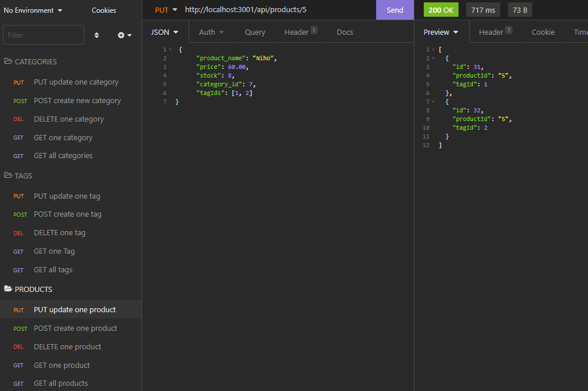

 

# Unit 13: E-Commerce ORM

## [Description](#description)

In this homework, I builded the back end of an e-comerce site. I use express, sequelize and MySQL database. 

The program has three API routes, Categories, Products, and Tags. The data of each of this routes is displayed in a formated json. Each API routes has a API GET, POST, PUT and DELETE route to display, create, update, and delete the data of the database. The database has 4 models for each area, Categories, Products, Tags and ProducTags.  

### Link to application:
Here is a screencapture video demostrating the functionality of the [application](https://watch.screencastify.com/v/i2O4Ze16iGPK6uptGC20). If this link does not work, you can try [this one](https://drive.google.com/file/d/1wpbAxS8HYk0XBIxW5Yk5FbfWZ4Hl2gPB/view).

## Table of Content

* [Description](#description)
* [Installation](#installation)
* [Test](#test)
* [Usage](#usage)
* [License](#license)
* [Contributing](#contributing)
* [Questions](#questions)

## [Installation](#installation)
To initialie, run the following command.

    node server.js

## [Test](#test)
To run tests, run the following command

    no tests at this moment

## [Usage](#usage)

This appliation is the back end of an e-comerce.

### Screenshot of MySQL displaying the Database:

### Screenshot of Insomnia displaying the api Routes:

GET all Products:

PUT update one product:

POST create one product:

GET one product:

DELETE one product:

GET one category:

POST create new category:

PUT update one category:

GET all category:

DELETE one category:

GET all Tag:

POST create one Tag:

PUT update one Tag:

GET one Tag:

DELETE one tag:

## [License](#license)

## [Contributing](#contributing)

none

## [Questions](#questions)

If you have any questions about the repo, or would like to contact me directly, 
here is my email: maribe.montes4@gmail.com. You can find more of my work at [Maribel Montes](https://github.com/MaryMD98).

